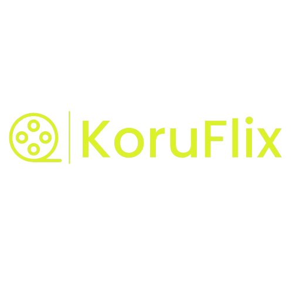

<h1 align="center" style="font-weight: bold;">KorúFlix</h1>

<h1 align="center">
    
    </br>
</h1> 


---
[](https://github.com/desenvolve06/r6_moovie_app)


## Vídeo-Apresentação do projeto
https://github.com/desenvolve06/r6_moovie_app/assets/101668192/df5753b5-768b-4dde-8e64-409ee6fa1717


## :pushpin:  Sobre o Projeto

O KoruFlux é um aplicativo desenvolvido em Dart e Flutter, que consume os dados fornecido pela API de busca de filmes e séties do site [TMDB(The Movies Database)](https://www.themoviedb.org/), explorando milhares de diferentes filmes. Ele utiliza esses dados estáticos para visualizar várias propriedades associadas aos filmes, identificando padrões nos dados e respondendo a perguntas-chave. O projeto tem como objetivo principal demonstrar a aplicação dos princípios SOLID e Clean na codificação e organização, além de implementar uma arquitetura de software sólida e robusta.

## Telas do aplicativo
1. Tela de início do app;
2. Tela de início: Exibe uma seleção de filmes e series mais populares. cada item é clicavel para 
visualizar os detalhes.
3. Tela de detalhes do Film/Series:  Mostra informações do filme e séries como: sinopse, avaliaçoes,
título, categoria.

## Funcionalidades
- Visualização de Filmes e Series Populares
- Pesquisa de filmes por titulo.
- Detalhes  de Filmes e Series Populares:.


## :rocket: Tecnologias Utilizadas

- [Dart](https://dart.dev/)
- [Flutter](https://flutter.dev/)


## Arquitetura

Este projeto segue intenções de uma arquitetura inspirada no padrão Clean Architecture. Ele é 
dividido em camadas para separar as responsabilidades e tornar o código mais organizado e testável.
As principais camadas são:

1. **Presentation Layer**: Responsável pela exibição da interface do usuário. Utiliza widgets e 
componentes Flutter para renderizar as telas.
2. **Domain Layer**: Contém as regras de negócio.
3. **Data Layer**: Responsável por obter dados do mundo externo neste casos uma lista estática de
séries e filmes, além de imagens da web.
Utiliza o padrão BLoC (Business Logic Component) para gerenciar o estado da aplicação. Ele separa 
a lógica de negócio da interface do usuário e facilita a reatividade da aplicação.

## Componentização

Os itens das telas foram componentizados para promover a reutilização de código e facilitar a 
manutenção. Cada componente representa uma parte específica da interface do usuário e é projetado
para ser independente e reutilizável em diferentes partes do aplicativo. Isso ajuda a manter o 
código limpo e modular.

Os seguintes componentes foram criados:

- Home: 
- **AppBar**: Componente  personalizado exibe indfomações de navegação
- **BannerList**: Esta classe é chamada BannerList e é um widget Flutter que exibe uma lista 
horizontal de banners de series. Cada banner contém uma imagem de fundo e o título.
- **MediaList**: Exibe detalhes de um filme, como título, descrição e imagem da capa.
- **NavBar**: Esta classe é denominada NavBarMain e é um widget Flutter que representa a barra de 
navegação lateral (drawer) de uma aplicação.
- **SearchBar**: Componente ppara buscar series e filmes.
- **MovieItem**: Exibe detalhes de um filme, como título, descrição e imagem da capa.
---
- Tela de Detalhes
- **archBanner_image**: Este é um widget Flutter chamado ArcBannerImage, que exibe uma
imagem em forma de banner com uma curva no topo. Ele recebe uma URL de imagem como 
entrada e utiliza a classe Image.network para carregar e exibir a imagem a partir da
URL fornecida. O parâmetro height é obrigatório e define a altura da imagem. O widget 
ajusta automaticamente a largura para ocupar toda a largura disponível na tela.
- **InfoRow**: Esse é um widget Flutter chamado InfoRow, projetado para exibir informações 
relacionadas a um filme, como data de lançamento, duração e gêneros. 
O widget recebe os dados da data de lançamento, duração e gêneros como parâmetros. 
- **MediaDetailHeader**: O componente MediaDetailHeader é um widget Flutter utilizado para exibir
a imagem do filme e uma segunda imagem menor que receberá uma outra imagem de filmes ou séries. Ele 
combina informações de imagem, como título e imagem de fundo 
- **Overview**: Exibe a sinopse das séries ou filmes.
- **TextList**: Exibe uuma lista dos textos que recebe as seguintes informações data de lancamento, 
duração do filme/series e categorias

---
## BLoC (Business Logic Component)

O BLoC é uma biblioteca que ajuda a gerenciar o estado da aplicação de forma reativa. Ele separa a 
lógica de negócio da interface do usuário e fornece um mecanismo para atualizar a interface sempre 
que o estado da aplicação muda. No contexto deste projeto, o BLoC é utilizado para gerenciar a 
lógica de busca de filmes e o estado da tela de detalhes do filme.

---
## IDE e versões utilizadas:
Este projeto foi desenvolvido em Android Studio e Visual Studio Code :
Hedgehog | 2023.1.1 Patch 2 Build #AI-223.8836.35.2231.10811636 Java JDK 17

---
Visual Studio Code Version: 1.88.1 (system setup)  
Date: 2024-04-10T17:41:02.734Z Electron: 28.2.8 ElectronBuildId: 
27744544 Chromium: 120.0.6099.291 Node.js: 18.18.2 V8: 12.0.267.19-electron.0 OS:
Windows_NT x64 10.0.22631

---
## Como Executar o Projeto
Para executar o projeto, é necessário ter o [Git](https://git-scm.com) e [Flutter](https://flutter.dev/docs/get-started/install) instalados em seu ambiente. Após execute os seguintes comandos:

```bash
# Clonar esse repositório
$ git clone https://github.com/desenvolve06/r6_moovie_app.git

# Entrar no diretório do projeto
$ cd r6_moovie_app
```

Criar uma API Key no [TMDB](https://www.themoviedb.org/documentation/api). Depois é necessário criar um arquivo `.env` na raíz do projeto. Siga o exemplo do arquivo  `.env.example`.
```bash
$ API_KEY=Insira o número de sua API Key
```

Instalar as dependências e executar o projeto após a atualização.
```bash
# Instalar as dependências
$ flutter pub get

# Executar o app
$ flutter run

# Para rodar os goldens testes da view
$ flutter test --update-goldens
```
## Bibliotecas e ferramentas Utilizadas no projeto
Camada Data
* Bloc : para gerenciamento de estados, Usado para separar a lógica de negócios da UI, lidar com eventos e estados, e facilitar a reatividade e a atualização da 
* Bloc provider:  Uma extensão do Bloc que fornece widgets de Flutter para injetar e acessar blocos em toda a árvore de widgets
interface do usuário com base nas mudanças de estado.
* Json annotation: Uma biblioteca Dart que fornece anotações para ajudar na serialização e desserialização de objetos Dart para JSON e vice-versa.
* Retrofit:  define os serviços REST e a serialização de respostas de API.
* Build runner e Built value: ferramenta de linha de comando que facilita a execução de tarefas de build em projetos Dart/Flutter, como a geração de código baseado em 
anotações, usado em conjunto com built_value e build_runner para automatizar a geração de código repetitivo em classes Dart, melhorando a legibilidade e a manutenção 
do código.
* Dio: utilizado para fazer requisições HTTP de forma eficiente, lidar com respostas JSON, e interagir com APIs de forma assíncrona
* Shared Preferences: biblioteca permite armazenar dados persistente localmente.
* GetIt: gerenciamento de dependências (Dependency Injection - DI), Usado para registrar e recuperar instâncias de serviços e objetos em toda a aplicação, 
* seguindo o princípio de Injeção de Dependência.
* Toolkit golden: Ferramenta de Flutter para testes de regressão visual
* Mocktail: biblioteca de mocks para testes unitários e de integração em Dart e Flutter. 
* Equatable: biblioteca Dart que facilita a implementação de classes de modelo que precisam de métodos == e hashCode baseados em uma lista fixa de campos.

## Conclusão

O KoruFlix é uma prova de conceito que demonstra a aplicação eficaz dos princípios SOLID e Clean na codificação e organização de um aplicativo Dart Flutter. 
A implementação do padrão BLoC contribui para a separação da lógica de negócio da interface do usuário, resultando em um código mais modular e testável. Este projeto exemplifica como a adoção desses princípios e padrões pode levar a um software robusto e eficiente.

## Screenshot
 

<h2 id="colab">🤝 Colaboradores</h2>

Todas as pessoas envolvidas no projeto.

<table>
  <tr>
    <td align="center">
      <a href="#">
        <br>
        <sub>
          <b>Arlan Nunes</b>
        </sub>
      </a>
    </td>
    <td align="center">
      <a href="#">
        <br>
        <sub>
          <b>Carlos Eduardo</b>
        </sub>
      </a>
    </td>
    <td align="center">
      <a href="#">
        <br>
        <sub>
          <b>Davi Roque</b>
        </sub>
      </a>
    </td>
    <td align="center">
      <a href="#">
        <br>
        <sub>
          <b>Luciana Cabral</b>
        </sub>
      </a>
    </td>
    <td align="center">
      <a href="#">
        <br>
        <sub>
          <b>Mauricio Muniz</b>
        </sub>
      </a>
    </td>
    <td align="center">
      <a href="#">
        <br>
        <sub>
          <b>Patrick Garcia</b>
        </sub>
      </a>
    </td>
    <td align="center">
      <a href="#">
        <br>
        <sub>
          <b>Vinicius Rodrigues Muller</b>
        </sub>
      </a>
    </td>
  </tr>
</table>


## License
---
MIT License
[](https://lbesson.mit-license.org/)

---

Made with ♥ by [Desenvolve R6 - Korú](https://github.com/desenvolve06)