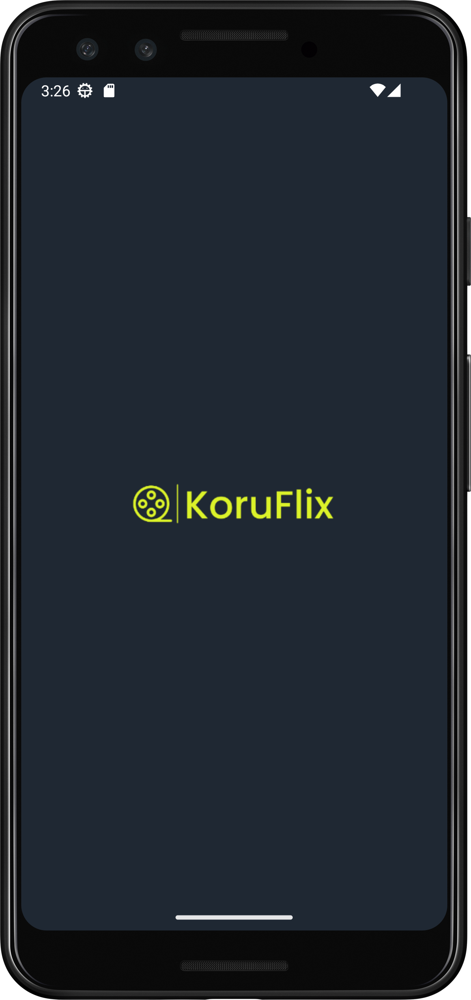
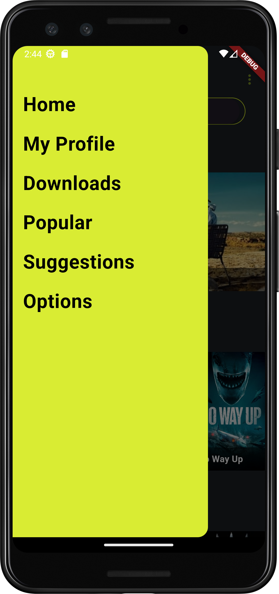
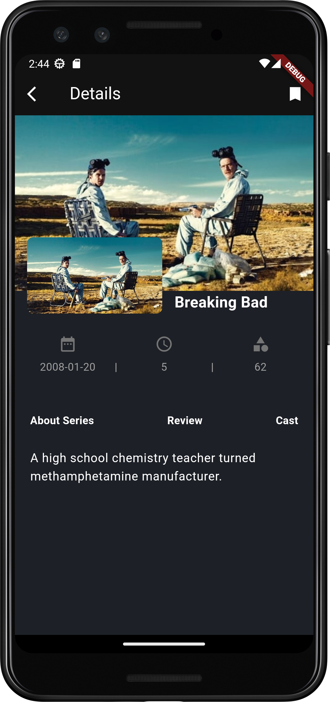

# r6_moovie_app

# Movie Search App

## Escopo do Projeto

Este é um projeto de prova de conceito (POC) desenvolvido em Dart Flutter, que utiliza a API de 
busca de filmes para obter dados estáticos sobre filmes. O objetivo principal deste projeto é 
demonstrar a aplicação dos princípios SOLID e Clean na codificação do código e na organização do 
projeto, além de implementar uma arquitetura de software intencionada.

## Telas do aplicativo
1. Tela de início do app;
2. Tela de início: Exibe uma seleção de filmes e series mais populares. cada item é clicavel para 
visualizar os detalhes.
3. Tela de detalhes do Film/Series:  Mostra informações do filme e séries como: sinopse, avaliaçoes,
título, categoria.

## Funcionalidades
- Visualização de Filmes e Series Populares
- Pesquisa de filmes por titulo.
- Detalhes  de Filmes e Series Populares:.

## Tecnologias Utilizadas

- Dart
- Flutter

## Arquitetura

Este projeto segue intenções de uma arquitetura inspirada no padrão Clean Architecture. Ele é 
dividido em camadas para separar as responsabilidades e tornar o código mais organizado e testável.
As principais camadas são:

1. **Presentation Layer**: Responsável pela exibição da interface do usuário. Utiliza widgets e 
componentes Flutter para renderizar as telas.
2. **Domain Layer**: Contém as regras de negócio.
3. **Data Layer**: Responsável por obter dados do mundo externo neste casos uma lista estática de
séries e filmes, além de imagens da web.
Utiliza o padrão BLoC (Business Logic Component) para gerenciar o estado da aplicação. Ele separa 
a lógica de negócio da interface do usuário e facilita a reatividade da aplicação.

## Componentização

Os itens das telas foram componentizados para promover a reutilização de código e facilitar a 
manutenção. Cada componente representa uma parte específica da interface do usuário e é projetado
para ser independente e reutilizável em diferentes partes do aplicativo. Isso ajuda a manter o 
código limpo e modular.

Os seguintes componentes foram criados:

- Home: 
- **AppBar**: Componente  personalizado exibe indfomações de navegação
- **BannerList**: Esta classe é chamada BannerList e é um widget Flutter que exibe uma lista 
horizontal de banners de series. Cada banner contém uma imagem de fundo e o título.
- **MediaList**: Exibe detalhes de um filme, como título, descrição e imagem da capa.
- **NavBar**: Esta classe é denominada NavBarMain e é um widget Flutter que representa a barra de 
navegação lateral (drawer) de uma aplicação.
- **SearchBar**: Componente ppara buscar series e filmes.
- **MovieItem**: Exibe detalhes de um filme, como título, descrição e imagem da capa.
---
- Tela de Detalhes
- **archBanner_image**: Este é um widget Flutter chamado ArcBannerImage, que exibe uma
imagem em forma de banner com uma curva no topo. Ele recebe uma URL de imagem como 
entrada e utiliza a classe Image.network para carregar e exibir a imagem a partir da
URL fornecida. O parâmetro height é obrigatório e define a altura da imagem. O widget 
ajusta automaticamente a largura para ocupar toda a largura disponível na tela.
- **InfoRow**: Esse é um widget Flutter chamado InfoRow, projetado para exibir informações 
relacionadas a um filme, como data de lançamento, duração e gêneros. 
O widget recebe os dados da data de lançamento, duração e gêneros como parâmetros. 
- **MediaDetailHeader**: O componente MediaDetailHeader é um widget Flutter utilizado para exibir
a imagem do filme e uma segunda imagem menor que receberá uma outra imagem de filmes ou séries. Ele 
combina informações de imagem, como título e imagem de fundo 
- **Overview**: Exibe a sinopse das séries ou filmes.
- **TextList**: Exibe uuma lista dos textos que recebe as seguintes informações data de lancamento, 
duração do filme/series e categorias

---
## BLoC (Business Logic Component)

O BLoC é uma biblioteca que ajuda a gerenciar o estado da aplicação de forma reativa. Ele separa a 
lógica de negócio da interface do usuário e fornece um mecanismo para atualizar a interface sempre 
que o estado da aplicação muda. No contexto deste projeto, o BLoC é utilizado para gerenciar a 
lógica de busca de filmes e o estado da tela de detalhes do filme.

---
## IDE e versões utilizadas:
Este projeto foi desenvolvido em Android Studio e Visual Studio Code :
Hedgehog | 2023.1.1 Patch 2 Build #AI-223.8836.35.2231.10811636 Java JDK 17

---
Visual Studio Code Version: 1.88.1 (system setup)  
Date: 2024-04-10T17:41:02.734Z Electron: 28.2.8 ElectronBuildId: 
27744544 Chromium: 120.0.6099.291 Node.js: 18.18.2 V8: 12.0.267.19-electron.0 OS:
Windows_NT x64 10.0.22631

---
## Como Executar o Projeto

1. Certifique-se de ter o Flutter instalado em sua máquina.
2. Clone este repositório.
3. Abra o projeto em seu editor de código favorito.
4. Execute `flutter pub get` para instalar as dependências do projeto.
5. Conecte um dispositivo físico ou inicie um emulador.
6. Execute `flutter run` para iniciar o aplicativo.

## Conclusão

Este projeto serve como uma prova de conceito para demonstrar a aplicação de alguns princípios SOLID e 
Clean na codificação do código e na organização do projeto.
A utilização do padrão BLoC ajuda a separar a lógica de negócio da interface do usuário, tornando o 
código mais modular e fácil de testar.

## Screenshot
   
    
 
 

